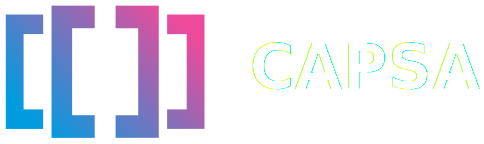

 

    
    <!-- SETUPTOOLS_LONG_DESCRIPTION_HIDE_BEGIN -->
    
    <!-- SETUPTOOLS_LONG_DESCRIPTION_HIDE_END -->

<h2>
Make Any Machine Learning Model Uncertainty-Aware
</h2>

# 📣 Announcements!

We are delighted to announce the launch of **<a href="https://themisai.io/blog/introducing-capsa-pro">Capsa Pro</a>**, a comprehensive implementation of the Capsa framework with significantly expanded compatibility and the necessary functionality required for serious machine learning applications. Capsa Pro was launched on July 1st to carefully selected customers and companies participating in our ongoing Private Beta. During this period, we will devote our efforts and resources to the support, development, integration, and collaborative projects related to this library.

Previously, we had presented Capsa Lite, a library with simplified and limited implementations of some procedures in the Capsa framework. It was provided only as an educational resource for students and researchers to learn about uncertainty estimation approaches through introductory examples and contained enough functionality to allow for some familiarity with the framework. As such, Capsa Lite, is not suitable for rigorous testing, evaluation, and/or deployment of machine learning models.

Our mission is to provide a unified framework for uncertainty estimation accessible to researchers and engineers across the world. We will continue progressing on this front through the development of the Capsa Pro library and are actively working on expanding its userbase as we grow.
